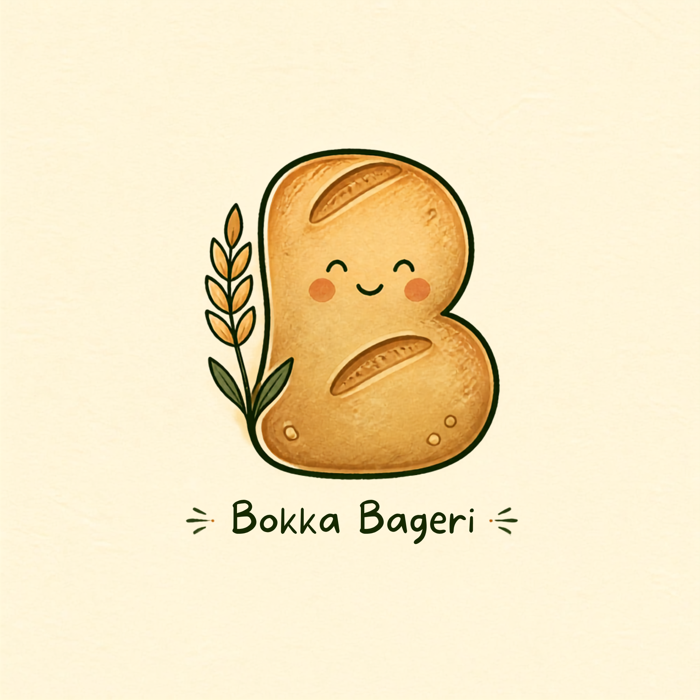

<p align="center">
  
</p>

<h1 align="center">Bokka Bageri</h1>

<p align="center"><em>Bakt med kjærlighet ved Bokkaskogen 🌾</em></p>

---

## Hva er dette?

**Bokka Bageri** is a tiny neighbourhood *nanobakery* near Bokkaskogen in
Stavanger, Norway. This repository holds the little one-page website for the
bakery — a warm, hand-drawn storybook landing page where neighbours can read
about the bakes and **register their interest**.

It is **not a webshop**. There is no checkout and no payment — just a friendly
interest form so we know who would love fresh sourdough and cardamom buns when
the oven is warm.

## Hva finnes her

- A mobile-first single-page site with a soft Scandinavian children's-storybook feel
- Product showcase (surdeigsbrød, kardemommeboller, surdeigs-cookies, and the
  upcoming *Bokka Dypp*)
- "Slik funker det" — how the little bakery works
- The **Bokka-Bobler** sourdough friends and the story of the bread wagon
- An interest-registration form (submitted asynchronously via Formspree)

All on-page text is in **Norwegian**.

## Kom i gang

No build tools, frameworks, or dependencies — just plain HTML, CSS, and vanilla
JavaScript. To view the site, open `index.html` in a browser:

```powershell
# from the project folder
start index.html
```

Or serve it with any static server, for example:

```powershell
npx serve .
```

## Prosjektstruktur

```
bokkabageri/
├─ index.html                  # The single-page site
├─ styles.css                  # Storybook brand styling
├─ script.js                   # Interest-form validation + reveal animations
├─ assets/
│  └─ images/
│     └─ branding/             # Logo and illustrations
└─ README.md
```

## Teknologi

- HTML5 · CSS3 · vanilla JavaScript
- Google Fonts: *Baloo 2*, *Caveat*, and system UI
- No frameworks, no npm build step

---

<p align="center"><sub>En liten prototype — ekte bilder og priser kommer når ovnen er varm.</sub></p>
